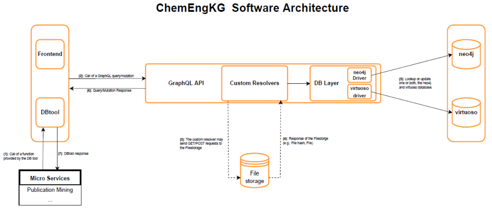

# Knowledge Graphs Lab: Chemical Publication
**Summer semester 2023, RWTH Aachen (i5) together with TU Delft (Process Intellifence Research)**

## Task
- Extract and structure "hidden" information from scientific (chemical) literatur and patens
- Save information in a knowledge graph
  - Make data FAIR (Findability, Accessibility, Interoperability, Reuseability)
- Setup Workflow: front end, back end, data mining service

## Technology stack
| Technology | Purpose |
|------------|---------|
| [Python](https://www.python.org/)     | Main programming language |
| GitHub     | Code develepement, including [GitHub actions](https://docs.github.com/en/actions) for CI |
| [Docker](https://docs.docker.com/)     | Code execution |
| [virtuoso](https://virtuoso.openlinksw.com/) | Graph database &rarr; store KG |
| [SPARQL](https://www.w3.org/TR/sparql11-query/)     | Query language for KG |
| [streamlit.io](https://docs.streamlit.io/) | Frontend developement |
| [PyTorch](https://pytorch.org/)    | Extraction from data &rarr; Image classification, deep CNN |
| [FastAPI](https://fastapi.tiangolo.com/)    | Implements RestAPI |

## Basic Software Architecture

Source: TU Delft, Process Intelligence Research

## TODOs
- [ ] Develop API for existing ML models for image classification
  - [ ] Define API specifications
  - [ ] Implement API in FastAPI
  - Requirements: include multiple different ML models, run in docker
- [ ] Implement micro-service automatically extracting images form publications
  - [ ] Get publication through SPARQL
  - [ ] Return extracted images to KG
  - Using existing micro-service structure, using python package KGtool
- [ ] Implement micro-service automatically classifiying images
  - [ ] Get images through SPARQL
  - [ ] Use implemented API to call ML model
  - [ ] Return predicted image type to KG
  - Using existing micro-service structure, using python package KGtool
- [ ] Extend existing streamlit frontend to view
  - [ ] Add KG statistics
  - [ ] Add graphs (e.g., how many images with specific type vs year)
  - [ ] Add overview of images that
    - user can sort, search, filter
    - according  to type, year, issn, ...

## Abbreviations:
| Abbreviation | Meaning |
|--------------|---------|
| ML           | Machine Learning |
| CI           | Continuous Integration |
| CNN          | Convolutional neural network |
| KG           | Knowledge Graph |

